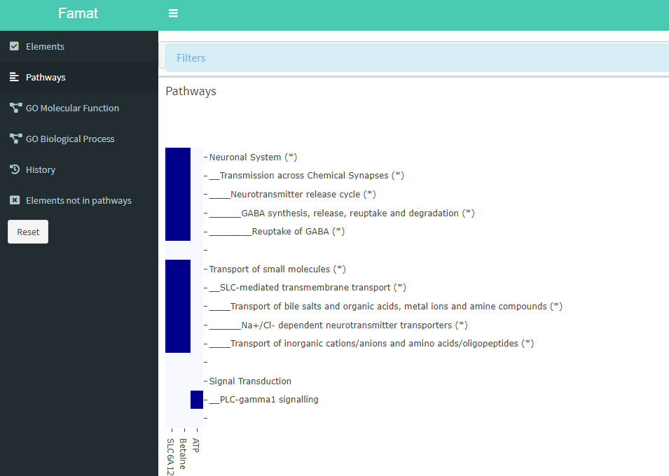

```{r style, echo = FALSE, results = 'asis'}
BiocStyle::markdown()
```

# Introduction

The aim of `r Rpackage("famat")` is to allow users to determine functional 
links between metabolites and genes. These metabolites and genes lists may 
be related to a specific experiment/study, but `r Rpackage("famat")` only 
needs a gene symbols list and a Kegg Compound ids list. Using these lists, 
`r Rpackage("famat")` performs pathway enrichment analysis, direct interactions
between elements inside pathways extraction, GO terms enrichment analysis, 
calculation of user's elements centrality (number of direct interactions 
between an element and others inside a pathway) and extraction of information
related to user's elements. 

Functions available are: <br><ul>
    <li> path_enrich : pathways enrichment analysis </li>
    <li> interactions : direct interactions and centrality </li>
    <li> compl_data : GO terms enrichment analysis and user's elements data
    extraction </li>
    <li> rshiny : use of previous function's data in a shiny interface </li>
</ul>

# Installation

Run this command line to install `r Rpackage("famat")`.
```{r, eval=FALSE}
if (!requireNamespace("BiocManager", quietly = TRUE))
    install.packages("BiocManager")

BiocManager::install("famat")
```

Then, load `r Rpackage("famat")` using library.
```{r load_famat, message=FALSE, warning=FALSE}
library(famat)
```

# path_enrich

This function uses the metabolite list and the gene list provided by user to 
perform pathway enrichment analysis. Metabolites ids need to be Kegg compound
ids, and genes ids need to be gene symbols. Three pathway databases are 
available: Kegg ("KEGG"), Wikipathways ("WP") and Reactome ("REAC").
```{r pathenrich}
data(genes)
data(meta)

listr=path_enrich("REAC", meta, genes)
```
Results are then stored into a list. This list must be used in "interactions"
function.

# interactions

"Interactions" find all direct interactions between genes and metabolites of
user's lists in pathways obtained through pathways enrichment analysis, 
performed on KEGG, Reactome and Wikipathways pathways. So, this function
needs results of "path_enrich" function performed on all these databases.
Using direct interactions, centrality of a user's element inside a pathway
is calculated.
```{r interactions}
data(listk)
data(listr)
data(listw)

interactions_result = interactions(listk, listr, listw)
```
Results are then stored into a list. This list must be used in "compl_data"
function.

# compl_data

This function complete information about elements and pathway obtained with
"path_enrich" and "interactions". A GO term enrichment analysis is performed
on genes, pathways obtained through pathways enrichment analysis are filtered
(they must contain at least 1/5 elements in user's lists or a direct 
interaction between user's elements) and a hierarchy parent-child is built 
with pathways and enriched GO terms. Then, dataframes containing information
about elements, interactions and GO terms are created, with an heatmap showing
which user's elements are in which pathways.
```{r compldata, message = FALSE}
data(interactions_result)

compl_data_result <- compl_data(interactions_result)
```
Results are then stored into a list. This list must be used in "rshiny"
function.

# rshiny

All results obtained with the three previous functions can be visualized using
"rshiny" function. 

```{r, eval=FALSE}
data(compl_data_result)

rshiny(compl_data_result)
```
After using this command line, the Shiny interface appear.


Interface's tabs are: <br><ul>
    <li> Elements : Genes, metabolites, interactions, and information related 
    to these elements. Also, filters can be applied to get pathways/enriched
    GO terms containing (or not) only certain elements. </li>
    <li> Pathways : Heatmap showing pathways hierarchies and user's elements
    in these pathways. Filters can be applied to get pathways corresponding 
    to certain pathways or interactions types, or to filter genes by their type
    or enriched GO terms. Also, the heatmap can be colored using interactions 
    types or centrality. Finally, click on a heatmap's cell makes a pop up 
    appear, with information about the pathway selected. </li>
    <li> GO Molecular Function : Enriched GO MF terms hierarchies with 
    information about them. Click on a GO term makes a pop up appear with data
    about the GO term selected. </li>
    <li> GO Biological Process : Enriched GO BP terms hierarchies with 
    information about them. Click on a GO term makes a pop up appear with data
    about the GO term selected. </li>
    <li> History : Every time a filter is applied, new results are saved in 
    history. So, user can go back if a mistake was done. </li>
    <li> Elements not in pathways : some user's elements may not be in pathways
    obtained by pathways enrichment analysis and filtered by compl_data 
    function. So, they are printed in this tab to show they were taken into 
    account. </li>
</ul>
Finally, a "Reset" button was made to go back to the initial results.

# how to use famat

To conclude, `r Rpackage("famat")` has four important functions which have to
be used one after another:
```{r famat, eval=FALSE}
data(genes)
data(meta)

listk <- path_enrich("KEGG", meta, genes)
listr <- path_enrich("REAC", meta, genes)
listw <- path_enrich("WP", meta, genes)

interactions_result <- interactions(listk, listr, listw)

compl_data_result <- compl_data(interactions_result)

rshiny(compl_data_result)
```

# Session Info
```{r}
sessionInfo()
```
